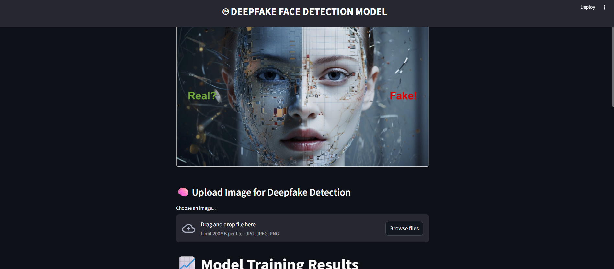

# 🔍 Deepfake Detection System using MobileNetV2 & Streamlit  
> A powerful AI-based system to detect manipulated or synthetic (deepfake) images and videos using lightweight deep learning models. Developed as part of the **Cyber Gyan Virtual Internship Program**, CDAC Noida – July 2025.  
  

## 📅 Project Timeline  
- **Start Date:** June 25, 2025  
- **Completion Date:** July 9, 2025  
- **Mentor:** Mr. Varun Mishra  
- **Organized By:** CDAC Noida - Cyber Gyan Virtual Internship Program  

## 🧠 Problem Statement  
Cybercriminals increasingly use deep learning technologies to manipulate facial media content for malicious purposes — ranging from fake news to financial fraud and explicit deepfakes. This project aims to **design and develop an intelligent detection system** to identify such tampered or fake media using MobileNetV2 and Streamlit.  

## 🛠️ Tools & Technologies  
| Component              | Technology Used               |  
|------------------------|-------------------------------|  
| Model Architecture     | MobileNetV2 (TensorFlow/Keras)|  
| Frontend               | Streamlit                     |  
| Image Processing       | OpenCV                        |  
| Dataset Augmentation   | ImageDataGenerator            |  
| Deployment             | Streamlit Cloud / Localhost   |  
| Programming Language   | Python 3.10                   |  

## 🧪 Features  
- Upload an image and detect if it's **REAL** or **DEEPFAKE**  
- Built using a **pre-trained MobileNetV2** model  
- Streamlit-based **interactive web interface**  
- Realtime model prediction with clean UI  
- Lightweight and optimized for fast inference  

## 🚀 Project Structure  
.
├── app.py # Streamlit UI
├── predict.py # Prediction logic
├── train.py # Model training script
├── deepfake_model.h5 # Trained Keras model
├── dataset/ # Images (real and fake)
├── screenshots/ # Screenshots of the app
└── requirements.txt

## 🖥️ How to Run Locally  
git clone https://github.com/igufrankhan/deepfake-detection
cd deepfake-detection
pip install -r requirements.txt
streamlit run app.py

## 🔗 Dataset Used  
We used the following dataset to train and test our deepfake detection model:  
📁 [**Real and Fake Face Detection Dataset – Kaggle**](https://www.kaggle.com/datasets/ciplab/real-and-fake-face-detection)  
- Contains high-resolution real and fake face images  
- Generated using advanced GAN architectures  
- Suitable for face manipulation detection tasks  

## 🙏 Thank You  
This project was completed under the guidance of **Mr. Varun Mishra**  
as part of the **Cyber Gyan Virtual Internship Program** organized by **CDAC Noida** in July 2025.  

